# Jokes Web App

## About
This is a tutorial project from Free Code Camp to practice ASP.Net. The YouTube video is available [here](https://www.youtube.com/watch?v=BfEjDD8mWYg)

## Installation
Fork the project and run in Microsoft Visual Studio to open up a local server. The database should already be available

## Usage
This app allows you to register, login, add, edit and delete a list of jokes.

#### Register:
Allows users to register to perform protected actions such as add, edit and delete.
  
Registarion Screen:
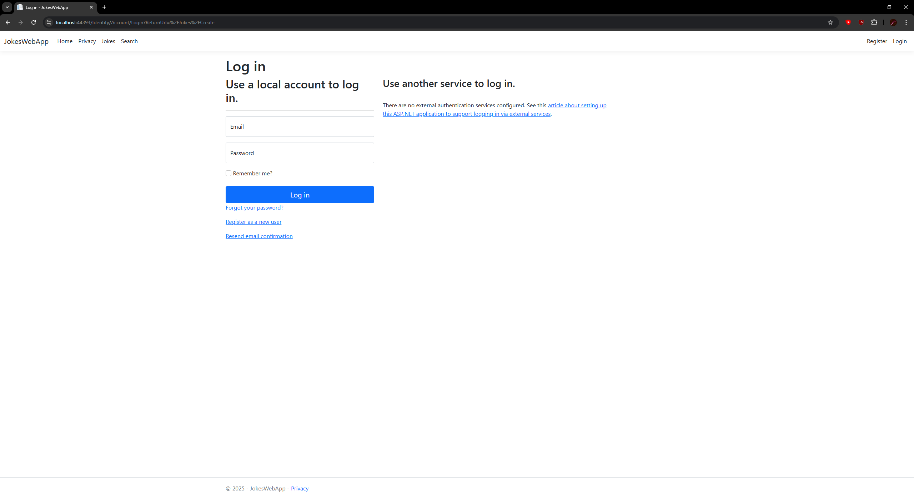

Registration Validation:
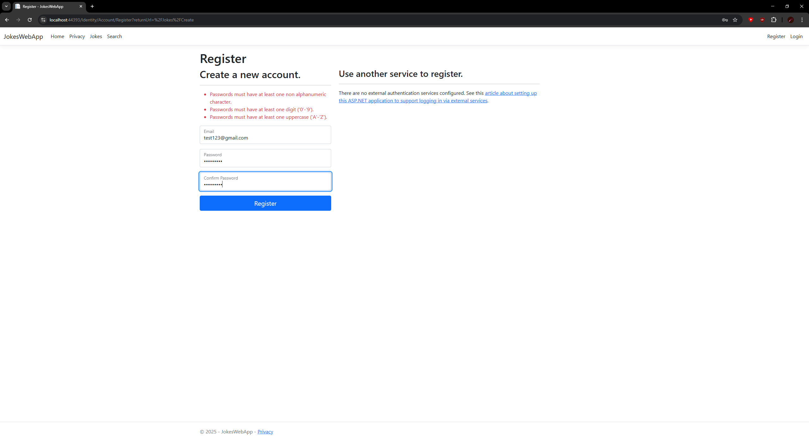

Registration Confirmation:
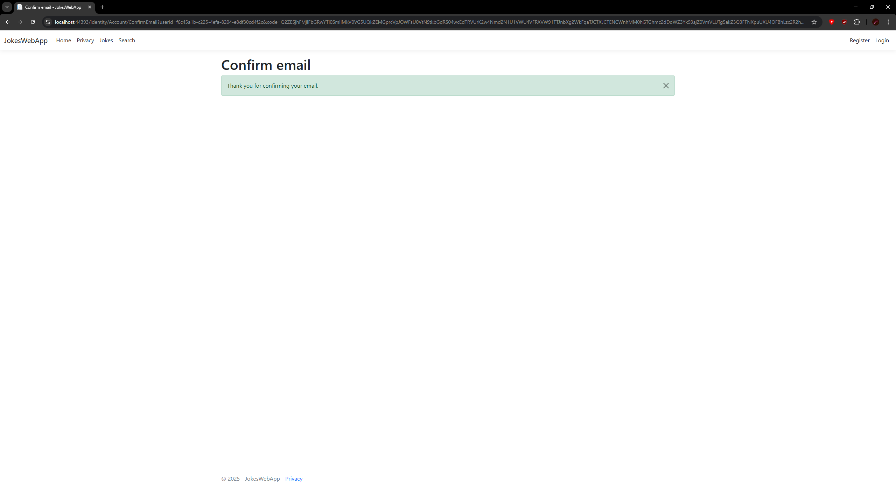

#### Login:
Allows registered users to login to perform protected actions such as add, edit and delete.
  
Login Screen:
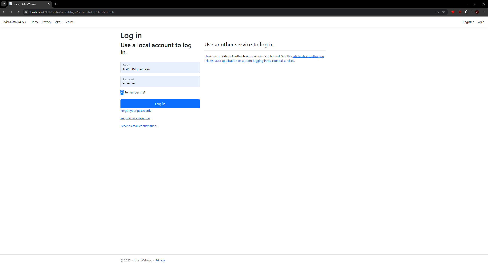

Invalid Login:
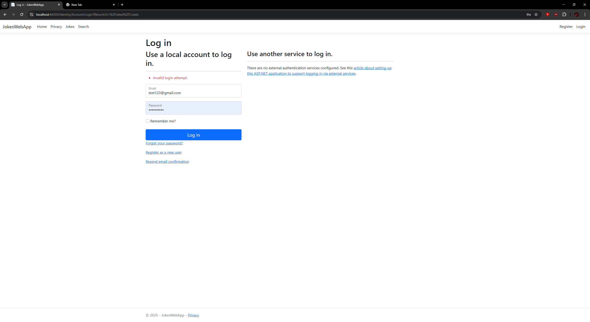

#### Jokes List
Display a list of jokes:
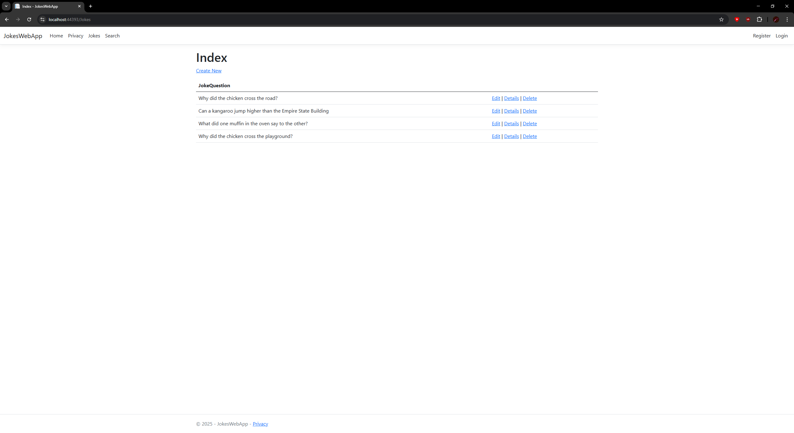

Create a new funny joke (requires authorization)
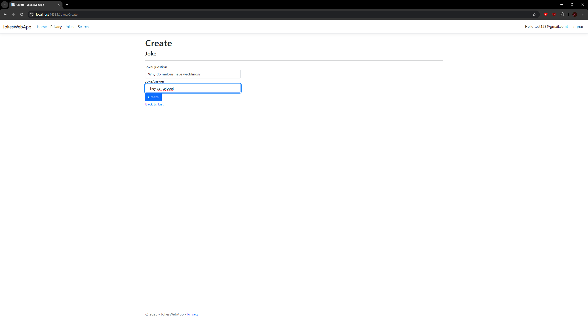

List after create:
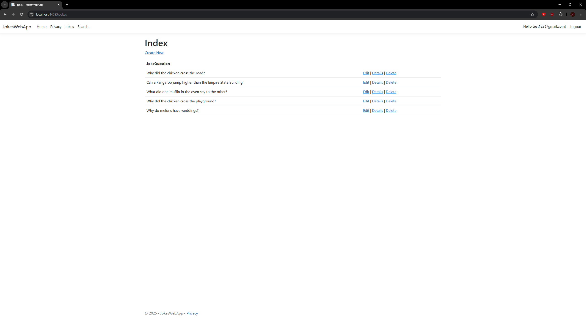

Joke Details: Look at details for the funny answers
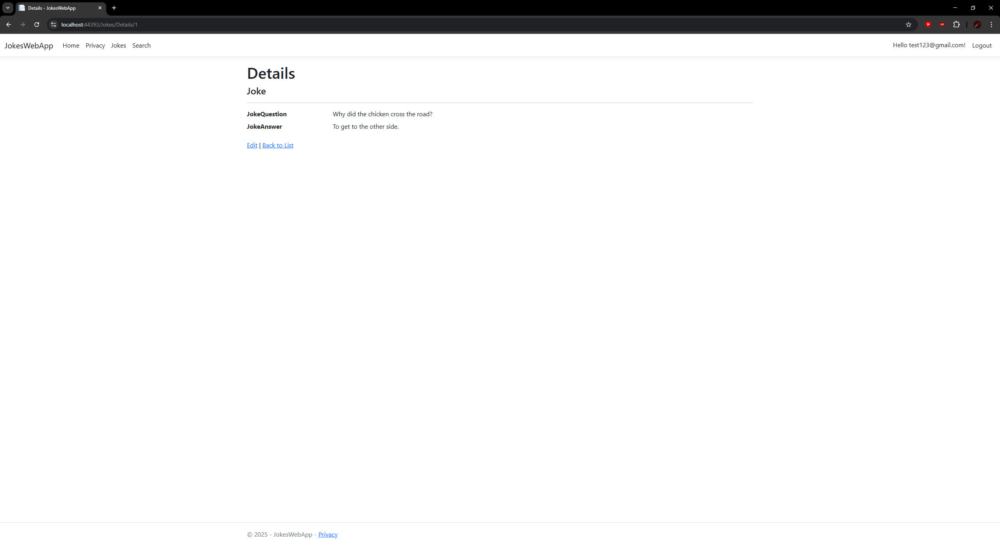

Delete Joke: Delete a joke that is not funny (requires authorization)
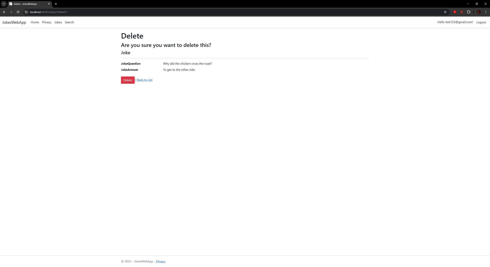

Edit Joke: Edit a joke to make it funnier (requires authorization)
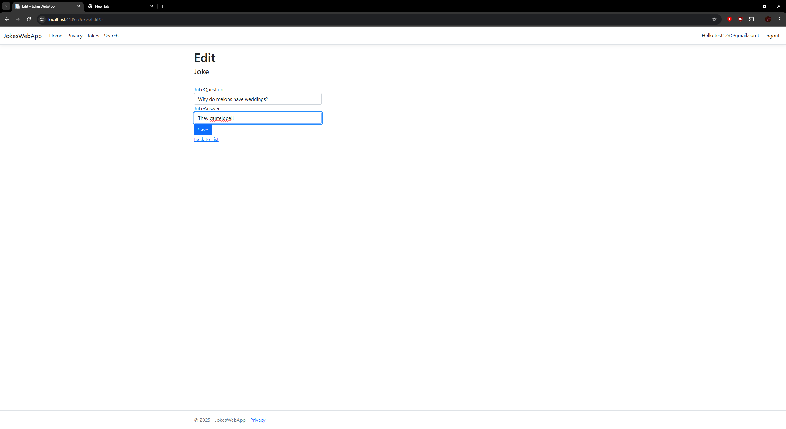

Edit Result: Joke Details after editing
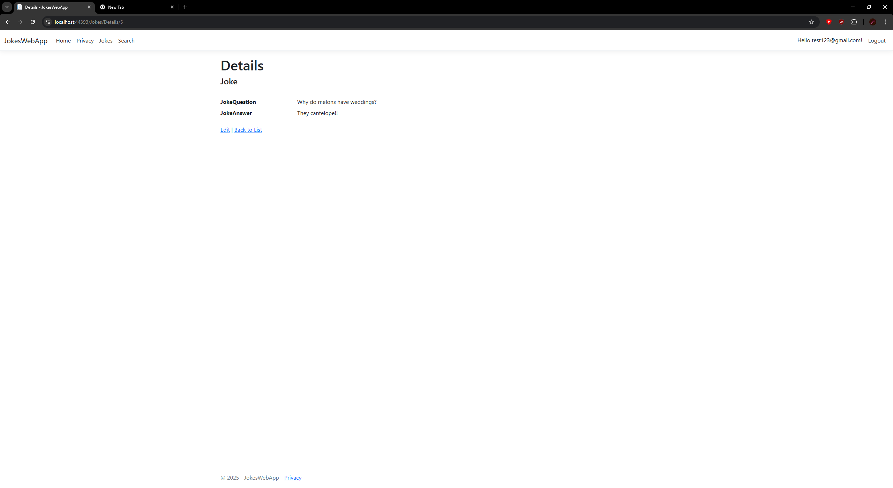